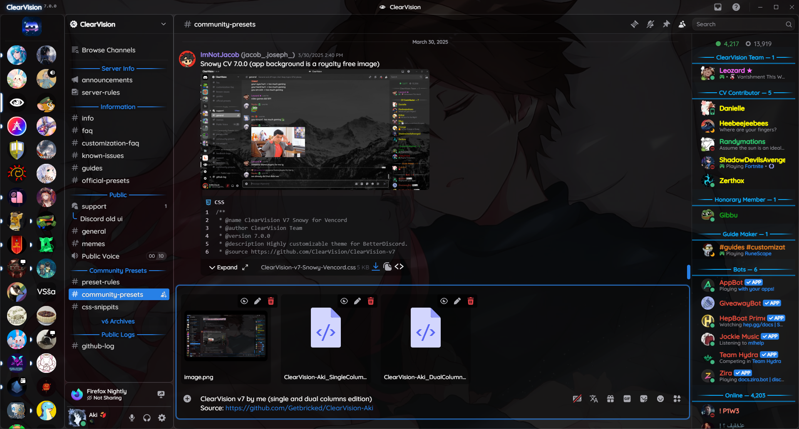
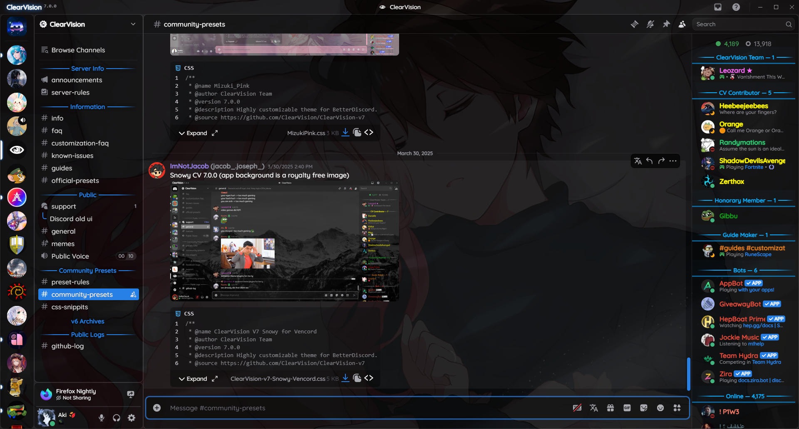
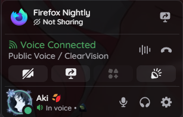
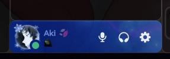
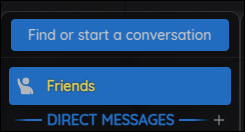
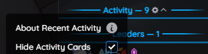

<div align="center">

# ClearVision v7 - Customized by Aki

**Original Theme Repository**: [ClearVision v7](https://github.com/ClearVision/ClearVision-v7)

---

## Previews

### Dual Columns Version



### Single Column Version



## </div>

## Installation

### Option 1: Manual Download

1. Download your preferred version:

   **For Vencord:**

- [Single Column](https://raw.githubusercontent.com/Getbricked/ClearVision-Aki/main/ClearVision-Aki_SingleColumn.css)
- [Dual Columns](https://raw.githubusercontent.com/Getbricked/ClearVision-Aki/main/ClearVision-Aki_DualColumns.css)

**For BetterDiscord:**

- [Single Column](https://raw.githubusercontent.com/Getbricked/ClearVision-Aki/main/ClearVision-Aki_SingleColumn.theme.css)
- [Dual Columns](https://raw.githubusercontent.com/Getbricked/ClearVision-Aki/main/ClearVision-Aki_DualColumns.theme.css)

2. Place the downloaded file in your themes folder.

### Option 2: Use Online Theme

**For Vencord:**

- **Single Column Version**

  ```
  https://raw.githubusercontent.com/Getbricked/ClearVision-Aki/main/ClearVision-Aki_SingleColumn.css
  ```

- **Dual Columns Version**

  ```
  https://raw.githubusercontent.com/Getbricked/ClearVision-Aki/main/ClearVision-Aki_DualColumns.css
  ```

**For BetterDiscord:**

- **Single Column Version**

  ```
  https://raw.githubusercontent.com/Getbricked/ClearVision-Aki/main/ClearVision-Aki_SingleColumn.theme.css
  ```

- **Dual Columns Version**

  ```
  https://raw.githubusercontent.com/Getbricked/ClearVision-Aki/main/ClearVision-Aki_DualColumns.theme.css
  ```

---

### Custom Background Image

Replace the URL inside `url()` with the link to your desired image.

```css
/* Custom Background Image */
:root {
  --background-image: url(https://i.imgur.com/zU7YY60.jpeg);
}
```

## Optional Add-ons

### Old User Panel (Enabled by Default)

#### In voice chat with activity:
<div align="center">

</div>

#### With nameplate on:
<div align="center">

</div>

- **Dual Columns**

  ```
  https://raw.githubusercontent.com/Getbricked/ClearVision-Aki/main/Utils/User_Panel_DC.css
  ```

- **Single Column**

  ```
  https://raw.githubusercontent.com/Getbricked/ClearVision-Aki/main/Utils/User_Panel_SC.css
  ```

---

### No Search Bar

<div align="center">

</div>

```
https://raw.githubusercontent.com/Getbricked/ClearVision-Aki/main/Utils/No_SearchBar.css
```

---

### Friends Only Mode

<div align="center">

</div>

```
https://raw.githubusercontent.com/Getbricked/ClearVision-Aki/main/Utils/Friends_Only.css
```

---

### No Activity (Hide it totally)

<div align="center">

</div>

```
https://raw.githubusercontent.com/Getbricked/ClearVision-Aki/main/Utils/Hide_Activity.css
```

---

## Advanced Customization

For further customization, fork the repository and tailor it to your preferences.
